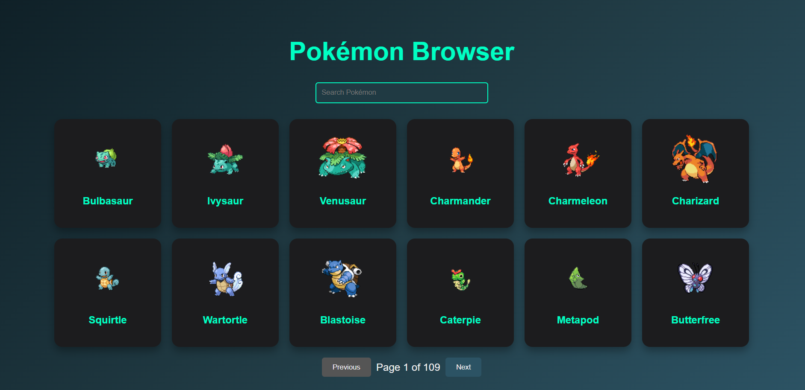
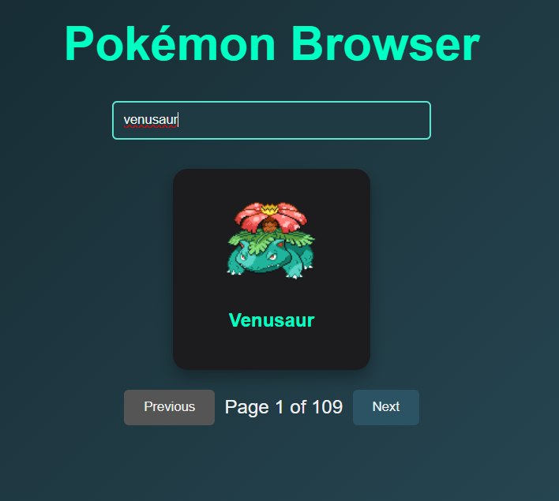

# Pokémon Search App
  This is a small React application that allows users to browse and search for Pokémon using the PokéAPI. The app displays Pokémon data in cards with images, provides a search functionality to filter the Pokémon list, and includes pagination to navigate between different pages. It also features a modern, animated, and responsive design.

# Live Demo
  You can try out the app live here: Pokémon Search App Live Link

# Features
  `Pokémon Cards`: Display Pokémon in cards, including their image and name.
  `Search Functionality`: Search for a specific Pokémon by name.
  `Pagination`: Navigate through the list of Pokémon with pagination buttons (Previous/Next).
  `Loading State`: Displays a loading spinner when Pokémon images are being fetched.
  `Beautiful UI`: Styled with modern CSS and animations using a dark theme with vibrant teal accents.

# Technologies Used
  `React`: For building the UI components and handling state.
  `PokéAPI`: To fetch Pokémon data.
  `CSS`: Custom styles with animations for a smooth and polished UI.
  `JavaScript (ES6)`: For logic and asynchronous operations.

# Screenshots
  
  

# Getting Started
  Follow these instructions to set up and run the project on your local machine.

## `Prerequisites`
  `Node.js`: Ensure you have Node.js installed on your machine. You can download it from Node.js official site.
  `npm or yarn`: You need to have npm (which comes with Node.js) or yarn installed to manage the dependencies.

# Installation 
  Clone the Repository
  Open your terminal and run: git clone https://github.com/yourusername/pokemon-search-app.git

# Navigate to the Project Directory 
  cd pokemon-search-app

# Install Dependencies
  Run the following command to install all the necessary dependencies: npm install

# Running the Application Locally
  Start the Development Server
  Run the following command to start the development server:  npm start

# View the App in the Browser
  Open your browser and go to http://localhost:3000 to view the app.

# File Structure

 pokemon-search-app/
│
├── public/
│   └── index.html         # The main HTML file for the app
│
├── src/
│   ├── components/
│   │   ├── PokemonCard.js # Component for displaying each Pokémon's card
│   │   ├── Pagination.js  # Component for pagination controls
│   │   └── App.js         # Main app component
│   ├── styles/
│   │   ├── App.css        # Global styles for the app
│   │   ├── Pagination.css # Styles for pagination component
│   │   └── PokemonCard.css # Styles for Pokémon cards
│   ├── index.js           # Entry point for the React app
│   └── App.js             # Main application logic
├── package.json           # Project metadata and dependencies
└── README.md              # This file
